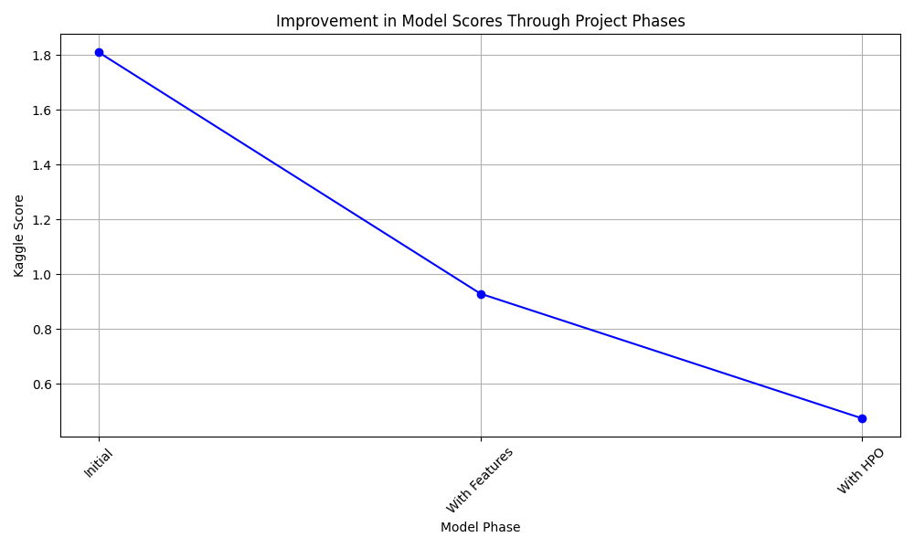
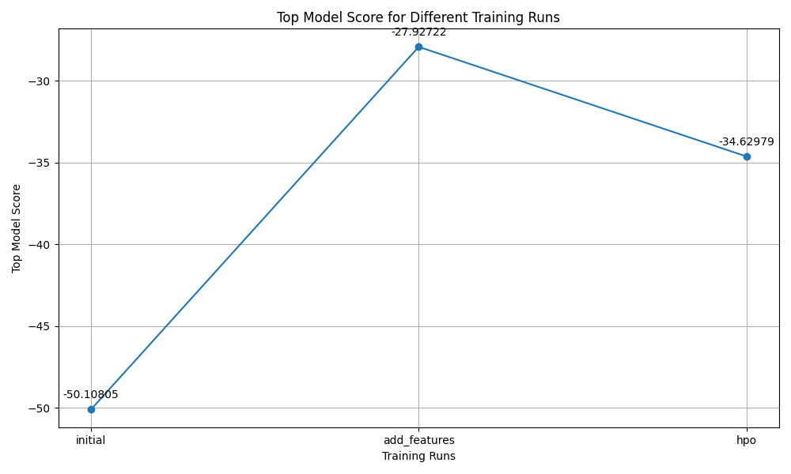
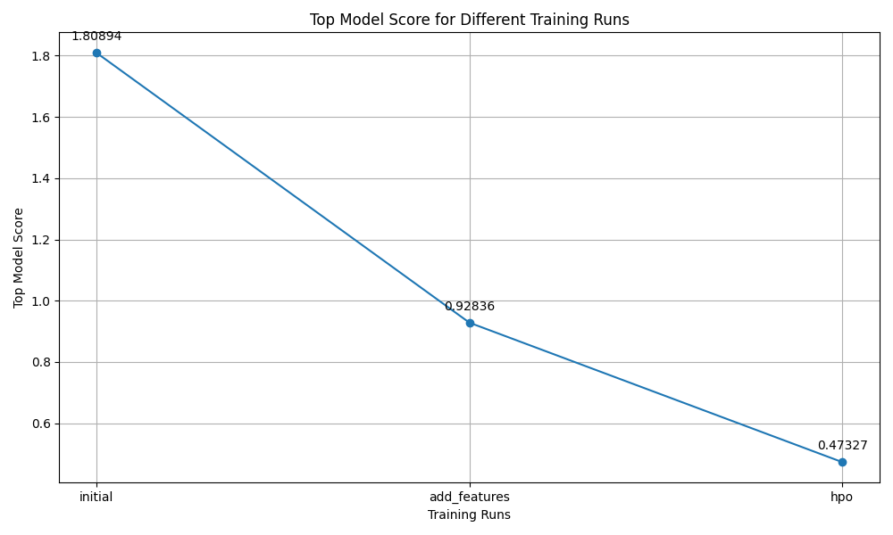

# Report: Predict Bike Sharing Demand with AutoGluon Solution
#### Name: Diego Francisco Luna Lopez

## Initial Training
### What did you realize when you tried to submit your predictions? What changes were needed to the output of the predictor to submit your results?
The importance of data management helps a lot to have adequate results. It was like analyzing and playing with TabularPredictor

### What was the top ranked model that performed?
The best was the "submission_new_hpo" or in the Hyperparameter Optimization step, where we have a big change, where we have a score of 0.47327, a difference from 0.93128 before.

## Exploratory data analysis and feature creation
### What did the exploratory analysis find and how did you add additional features?

The EDA process led to several key discoveries:

- Temperature and Feels-Like Temperature (atemp): Showed a normal distribution around 20-30 degrees Celsius, suggesting optimal biking conditions.
- Humidity: Revealed a wide range of values, influencing riding preferences and habits.
- Windspeed: Indicated that lower windspeeds are more common, which are favorable for biking.
- Casual vs. Registered Users: Data showed higher usage among registered compared to casual users, suggesting differing usage patterns that could inform targeted modeling strategies.

These findings prompted the creation of new features like time-based (hour, month) and categorical weather conditions, directly enhancing the model's predictive power by aligning it more closely with real-world usage patterns.

### How much better did your model preform after adding additional features and why do you think that is?
The incorporation of new features resulted in an improved Kaggle score from 1.80894 to 0.92836. This improvement was primarily due to the model's enhanced ability to capture complex patterns and relationships within the data, particularly those related to time and weather, which are critical determinants of bike-sharing demand.

## Hyper parameter tuning
### How much better did your model preform after trying different hyper parameters?
Great progress was made in the initial version (submission.csv): the first submission obtained a score of 1.80894.

After adding new features (submission_new_features.csv): the score improved significantly to 0.92836. This improvement indicates that the addition of new features significantly improved the model's ability to predict bike-sharing demand more accurately.

And after hyperparameter optimization (submission_new_hpo.csv): the score improved further to 0.47327. This is the lowest score among their submissions, demonstrating the highest level of accuracy in terms of RMSE (root mean square error), with lower values indicating better performance.

Hyperparameter optimization adjusted aspects of the model, such as learning rates, and parameters of the neural network architecture, allowing the model to better generalize from the training data without overfitting.

### If you were given more time with this dataset, where do you think you would spend more time?
I would like to do a deeper analysis of the data, to better have a model without being overtrained, I think there may be something in the use of more categories such as working days. and see the results

### Create a table with the models you ran, the hyperparameters modified, and the kaggle score.
|model|hpo1|hpo2|hpo3|score|
|--|--|--|--|--|
|initial|GBM: default settings	|NN: default settings	|CAT: default settings	|1.80894|
|add_features|GBM: default settings	|NN: default settings	|CAT: default settings	|0.92836|
|hpo|GBM: num_boost_round: 150, 250	|NN_TORCH: num_epochs: 20, 40	|CAT: iterations: 150, 250	|0.47327|

|model|hpo1|score|
|--|--|--|--|--|
|initial|Default settings	|1.80894|
|add_features|Added temporal features|0.92836|
|hpo|Optimized parameters|0.47327|

the best model is "WeightedEnsemble_L3"

### Create a line plot showing the top model score for the three (or more) training runs during the project.

### Create a line plot showing the top kaggle score for the three (or more) prediction submissions during the project.

## Summary
The journey from initial model training to hyperparameter optimization illustrates a clear trajectory of improvement, underscored by strategic data analysis and feature engineering. Each phase of the project not only enhanced the model's accuracy but also deepened our understanding of key drivers affecting bike-sharing demand.
